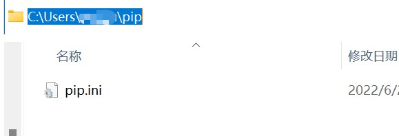

## 在用户文件夹下建立pip文件夹，建立pip.ini文件 

位置：
C:\Users\用户名称\\

建立后：C:\Users\用户名称\pip

 

## pip.ini文件下写入内容

```
[global]
index-url = https://pypi.mirrors.ustc.edu.cn/simple
[install]
trusted-host = https://pypi.mirrors.ustc.edu.cn
```

其他国内镜像(自行替换)：

阿里云:http://mirrors.aliyun.com/pypi/simple

中国科技大学:https://pypi.mirrors.ustc.edu.cn/simple

豆瓣(douban):http://pypi.douban.com/simple

清华大学:https://pypi.tuna.tsinghua.edu.cn/simple

中国科学技术大学:http://pypi.mirrors.ustc.edu.cn/simple